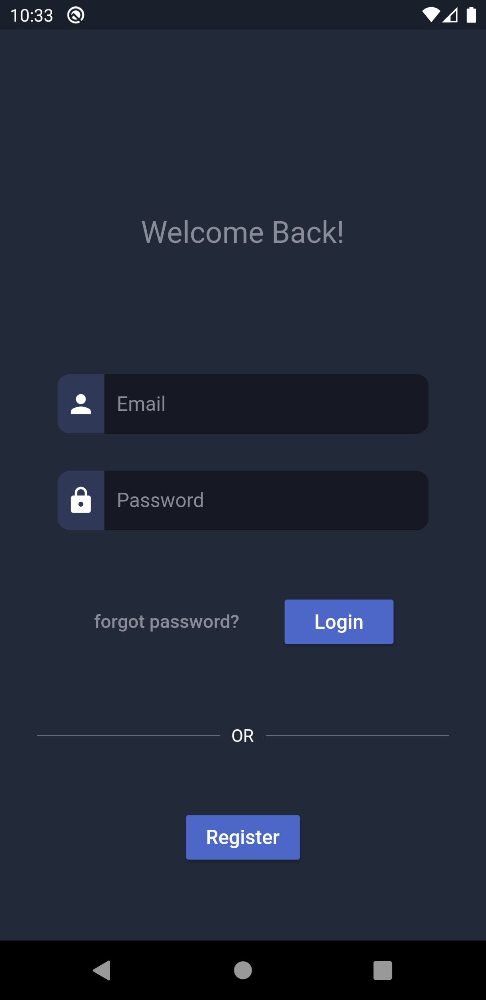
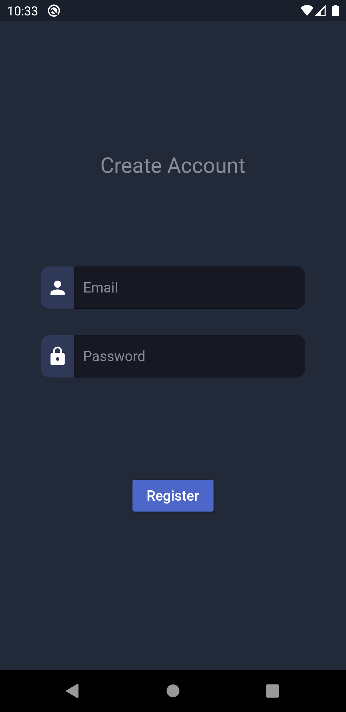
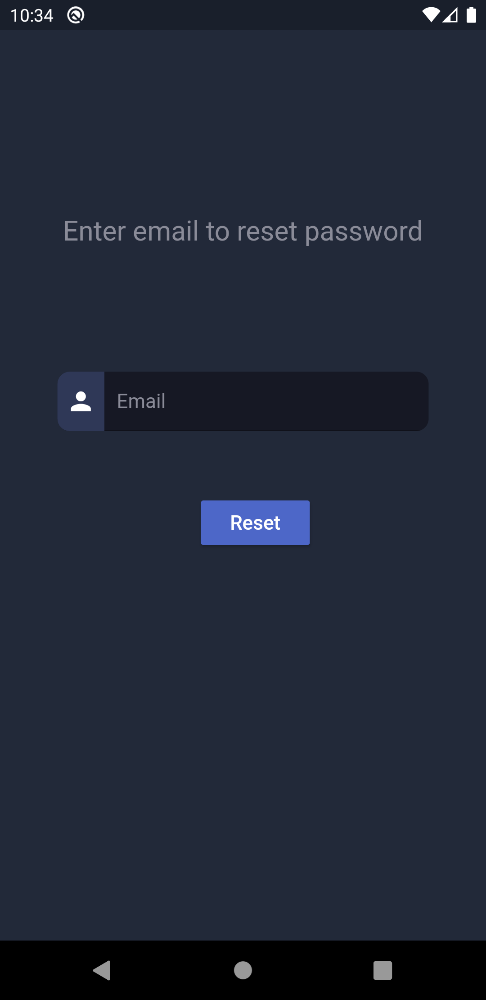

# Auth System 

A multi-factor authentication system using Flutter and Firebase Authentication plugin.
The system register a new user with an email and password. After the user verify his\her email, he can login to the system with the email, password and fingerprint.

  

